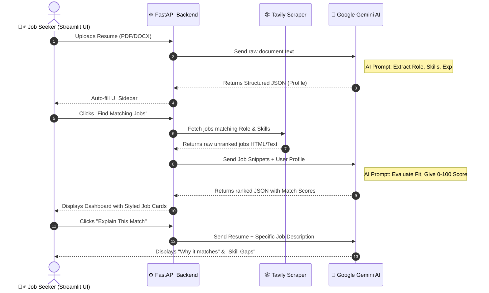

# 🚀 AI-Powered Job Finder Pro

Welcome to the **AI Job Finder Pro** project documentation! This document outlines the complete architectural flow, highlights how AI powers the core engine, and details the challenges faced when integrating Large Language Models (LLMs) into the application.

---

## ✨ How It Works: The "Powered by AI" Flow

Below is the complete step-by-step visual architecture of the system:



---

## 🛠️ Step-by-Step AI Workflows

### 1. 📄 Resume Parsing (Data Extraction)
Instead of forcing users to manually enter their skills, they simply upload their resume.
* **The Flow:** Streamlit reads the `.pdf` or `.docx` bytes, sends it to FastAPI, which then forwards the raw text to Google Gemini. 
* **The Magic:** We configured the AI to strictly output a JSON object containing `role`, `skills`, `experience`, and `location`. This auto-populates the entire frontend sidebar instantly.

### 2. 🔍 Smart Scraping (Tavily API)
* **The Flow:** Instead of scraping the whole internet blindly, we use the extracted role and skills to construct an optimized query via the Tavily Search API. 
* **The Magic:** We restrict the domain to trusted job sites (like `naukri.com`, `linkedin.com`) to fetch highly relevant and recent job openings.

### 3. ⭐ AI Ranking (The Core Brain)
* **The Flow:** Web search returns dozens of job descriptions. The backend bundles the user's Extracted Profile and the batch of Jobs, sending them to Gemini.
* **The Magic:** Gemini acts as an automated HR Recruiter. It reads each job snippet and scores it (0-100) based on how well the user's experience matches the job requirements. Jobs are automatically ranked on the UI from highest to lowest score.

### 4. 🧠 AI Career Advisor
* **The Flow:** If a user is missing skills for their dream job, they can switch to the "AI Career Advisor" tab.
* **The Magic:** Gemini dynamically builds a **Step-by-Step Roadmap**, pointing out *Must-Have Skills*, highlighting *Skill Gaps*, and estimating the *Average Salary Range*.

---

## ⚠️ Challenges in Building an AI Agent (What making this entailed)

Integrating LLMs like Google Gemini into a structured web application comes with several unique challenges:

1. **Unpredictable Output (Hallucinations) & JSON Parsing:**
   * **Challenge:** LLMs are text generators, not traditional APIs. Sometimes Gemini returns conversational text like _"Here is your JSON:"_ before the actual JSON block, which crashes the `json.loads()` parser.
   * **Solution:** We had to write robust regex cleanup functions to strip out Markdown code blocks (````json ... ````) and force the LLM via prompt engineering to only respond with raw JSON.

2. **Latency & Response Times:**
   * **Challenge:** Sending large batches of job descriptions to an LLM takes time (sometimes 5-10 seconds), causing the frontend to hang and look unresponsive.
   * **Solution:** Implemented UI spinners using `st.spinner()` and heavily relied on backend caching (dictionary cache) so duplicate searches return instantly without hitting the AI.

3. **Handling Unstructured PDF/DOCX Data:**
   * **Challenge:** Resumes are notoriously messy (multi-column layouts, tables, images). `pypdf` might read columns left-to-right across the page instead of top-to-bottom.
   * **Solution:** We rely on the LLM's superior reasoning to piece together broken sentences and infer the correct timeline, effectively treating the AI as a highly resilient fuzzy parser.

4. **Context Window Limitations (Token usage):**
   * **Challenge:** If we scraped 50 full job descriptions, passing all that data to the LLM at once would exhaust token limits and incur high API costs.
   * **Solution:** We truncate job descriptions (sending only the first 500-1000 characters or "snippets"). Usually, the first few paragraphs of a job description contain all the hard requirements needed for accurate scoring.

5. **API Rate Limits:**
   * **Challenge:** Both Tavily (for searching) and Google GenAI have strict rate limits (Requests Per Minute/Day) on free or lower-tier usage.
   * **Solution:** Robust `try-except` blocks. If the scraper or AI fails, the FastApi server catches it, logs it, and gracefully returns a clear error message to Streamlit rather than crashing the interface.
